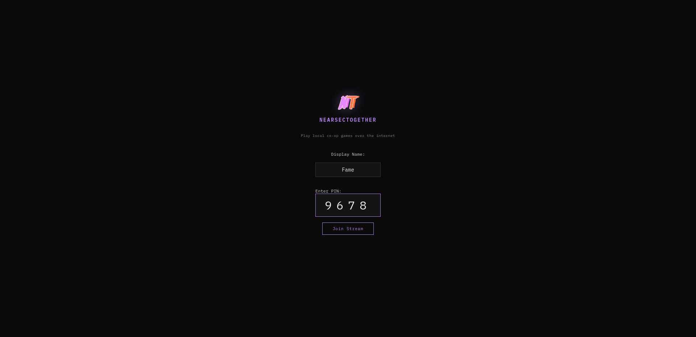
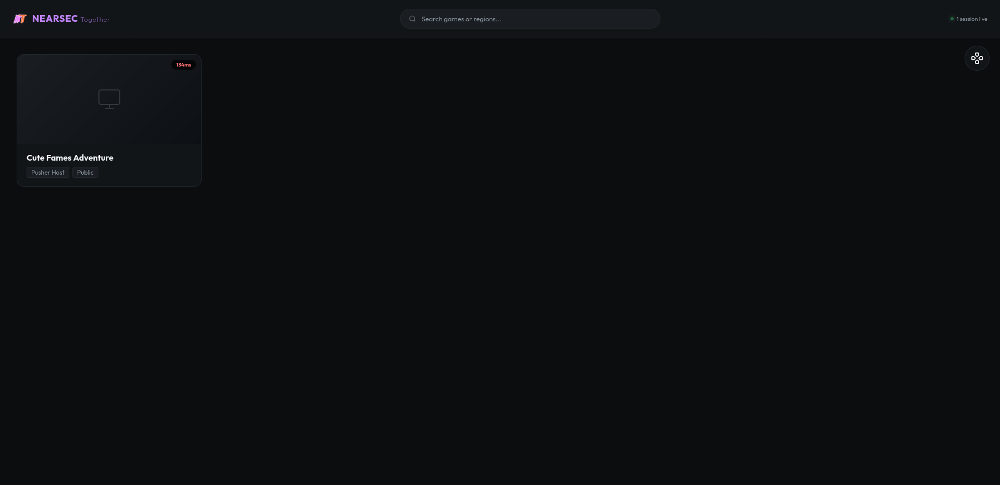

   
  

## Screenshots

  
  
  

# NearsecTogether

## Project Description
NearsecTogether is a low-latency, open-source platform that allows you to play local co-op games over the internet with your friends. By leveraging the power of standard WebRTC for UDP-first streaming and built-in browser hardware encoders, NearsecTogether provides an imperceptible latency experience that rivals commercial cloud gaming platforms, tailored specifically for self-hosted instances.

Unlike traditional cloud gaming solutions that relied on massive data center pipes and custom QUIC/VP9 hardware encoders, NearsecTogether is optimized to work elegantly over a standard home internet connection.

## Technology Stack
- **The Transport**: WebRTC handles the jitter buffer and NAT traversal automatically.
- **The Distributor**: To prevent overloading your home network upload bandwidth when streaming to multiple people, you can pair this with an SFU (Selective Forwarding Unit) or utilize the direct Port Forwarding and tunneling options built right into the app.
- **The Encoder**: The software seamlessly accesses your system's hardware encoding (like NVENC and VAAPI) via the WebRTC API to deliver optimized H.264 or VP8/VP9 streams based on your connection quality.

## Getting Started & Project TaskBoard
### Requirements
- Node.js installed on your host system.
- Linux with `uinput` kernel module loaded.
- Python 3 and `python-uinput` library.

### Getting Started
1. Clone the repository.
2. Launch the server script: `./start`. This will automatically install any missing dependencies like Electron and `python-uinput`.
3. Open your router and set up port forwarding for TCP 3000, or choose one of the free tunneling options provided directly in the host interface.
4. Share the provided link and PIN with your friends!

### Security Enhancements
- **PIN Rate Limiting**: The built-in WebSocket server defends against PIN brute-forcing by automatically rate-limiting failed connection attempts.
- **Version Parity Checks**: The client will detect if the host is running a divergent version and alert the user immediately to prevent compatibility issues.
- **Input Boundaries**: Strict isolation prevents clients from sending arbitrary keyboard inputs or overriding unauthorized gamepad slots.

## Troubleshooting & Compilation
### WebRTC Handshake Failing / GPU Errors
If the app is stuck and you're seeing `vulkan_swap_chain.cc Swapchain is suboptimal` or similar GPU crashes in the terminal, it means your system's graphics drivers are rejecting Electron's hardware acceleration flags.

**To fix this**:
1. Open `electron-main.js`.
2. Find the `app.commandLine.appendSwitch('enable-features', ...)` block.
3. Remove flags one by one (such as `VaapiVideoEncoder,VaapiVideoDecoder`) until the stream stabilizes. 
4. If you had to remove them, your system may fall back to software encoding (VP8/VP9) which will increase CPU usage but guarantee a stable WebRTC handshake.

### Building Electron from scratch (if the pre-built binary fails)
If `npm install` fails to pull down the correct Electron binary for your architecture:
1. Delete the node modules: `rm -rf node_modules package-lock.json`
2. Clear npm cache: `npm cache clean --force`
3. Re-install: `npm install`
(Electron relies on pre-compiled binaries; if you are on an unusual architecture, you may need to build it from source via `electron/build-tools`, but this is very rarely needed).

## Current Progress
- Core Host UI with integrated WebRTC capture controls.
- Port Forwarding, Cloudflared, and automatic tunneling integration.
- Controller input virtualization using `uinput` for seamless Steam Input bypassing.
- Dynamic bitrate scaling with user-selectable degradation preference.

# Disclaimer, This project used llm's for code generation.
